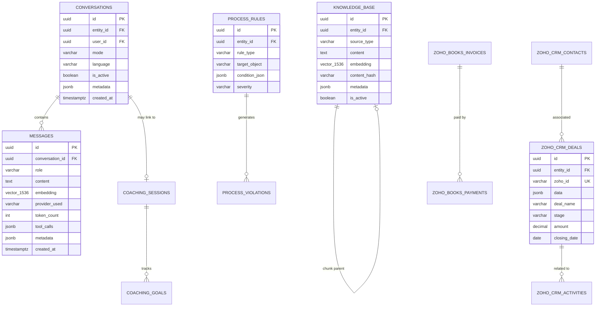

# Clara – Zentrale KI-Assistenz für aqua | Strategisches Gesamtkonzept

> Subprojekt von ClarityBoard | Version 1.0 | März 2026

---

# TEIL 1: FACHKONZEPT

---

## 1. Executive Summary

### Das Vorhaben

Clara ist die zentrale KI-Assistenz für aqua (aqua-cloud.io), entwickelt als Subprojekt der ClarityBoard-Plattform. Clara transformiert die Art und Weise, wie das Vertriebsteam mit CRM-Daten, Kunden und internen Prozessen interagiert – von manueller, fragmentierter Datenpflege hin zu einem intelligenten, proaktiven „Central Brain", das Wissen konsolidiert, Prozesse durchsetzt und Vertriebsmitarbeiter coacht.

### Strategische Bedeutung

aqua ist seit über 20 Jahren Marktführer in IT-Qualitätssicherung mit 200+ Enterprise-Kunden in 22 Ländern. Der komplexe Enterprise-Sales mit langen Entscheidungszyklen, Compliance-Nachweisen und individuellen Demos erfordert exzellente CRM-Disziplin. Aktuell liegt die CRM-Datenqualität bei geschätzt ~60%, was zu verlorenen Opportunities, ineffizienten Handoffs und fehlender Transparenz führt.

Clara adressiert dieses Problem als **Phase 1 (Sales Assistant MVP)** mit dem Ziel, bis Q4 2026 zur unternehmensweiten Wissensplattform zu wachsen.

### Erwarteter ROI (Phase 1)

| Metrik | Aktuell | Mit Clara | Verbesserung |
|--------|---------|-----------|--------------|
| CRM-Datenqualität | ~60% | >95% | +35 Prozentpunkte |
| Zeitaufwand CRM-Pflege/Woche pro Rep | ~8h | ~2h | –75% (6h gespart) |
| Durchschnittliche Deal-Velocity | 90 Tage | 75 Tage | –17% |
| Pipeline-Visibility | Fragmentiert | Echtzeit-360° | Qualitativ |
| Conversion Rate (Qualified → Closed) | ~22% | ~28% | +27% |

### Erfolgsfaktoren

1. **Nahtlose Zoho CRM/Books-Integration** – bidirektionale Echtzeit-Synchronisation
2. **Natürliche Sprach-Interaktion** – Deutsch, Englisch, Russisch; Text + Voice
3. **Proaktives Coaching** – tägliche Morning Sessions statt reaktiver Reports
4. **Soft Guidance + Hard Checks** – Prozesse werden erleichtert, nicht erzwungen
5. **Central Brain** – semantische Suche über alle Geschäftsdaten
6. **Aufbau auf ClarityBoard** – nutzt bewährte Clean Architecture, AI-Middleware, Multi-Tenancy

---

## 2. Vision und Strategische Bedeutung

### 2.1 Langfrist-Vision: Das „Central Brain"

Clara wird zum zentralen Nervensystem des Unternehmens. Nicht ein weiteres Tool, sondern **die eine Intelligenzschicht**, die über allen Datenquellen liegt:

```
Phase 1 (2026 Q2-Q3):  Sales Assistant MVP
                        → Zoho CRM + Books, Coaching, Prozess-Enforcement

Phase 2 (2026 Q4):     Finance & Operations
                        → Rechnungswesen, Budgetierung, Cash-Flow-Prognosen

Phase 3 (2027 Q1):     Marketing & Product
                        → Lead-Scoring, Kampagnen-ROI, Feature-Requests

Phase 4 (2027 Q2+):    Enterprise Intelligence
                        → Cross-Department Insights, Predictive Analytics, Board-Reporting
```

### 2.2 Strategische Einordnung in aquas Digitale Transformation

aqua lebt AI. Der eigene AI Copilot generiert Testfälle in Sekunden. Clara bringt diese AI-DNA **nach innen** – was aqua für Kunden tut (QA-Effizienz durch AI), tut Clara für aqua selbst (Sales-Effizienz durch AI). Dies stärkt:

- **Glaubwürdigkeit**: „Wir nutzen AI nicht nur – wir leben AI"
- **Employer Branding**: Moderne, AI-gestützte Arbeitsumgebung
- **Skalierbarkeit**: Wachstum von 200 auf 500+ Kunden ohne proportional mehr Vertrieb
- **Wissenserhalt**: Implizites Sales-Wissen wird explizit im Central Brain

### 2.3 Das „Central Brain"-Konzept

Das Central Brain ist keine separate Datenbank, sondern eine **semantische Intelligenzschicht**:

- **Wissen aus Zoho CRM**: Jeder Deal, jede Aktivität, jeder Kontakt wird vektorisiert und semantisch suchbar
- **Wissen aus Zoho Books**: Rechnungsstatus, Zahlungsverhalten, Umsatztrends
- **Wissen aus Coaching-Sessions**: Best Practices, erfolgreiche Pitch-Strategien, Einwandbehandlung
- **Wissen aus Dokumentation**: Angebote, Verträge, Compliance-Nachweise

Jeder Mitarbeiter kann Clara fragen: *„Welche Erfahrungen haben wir mit Banken gemacht, die ISO 27001 verlangen?"* – und erhält eine synthesierte Antwort aus allen Quellen.

---

## 3. Aktuelle Pain Points und Chancen

### 3.1 Pain Points im Detail

#### Pain Point 1: CRM-Datenqualität (~60%)
- **Symptom**: Unvollständige Deal-Records, fehlende Aktivitäten, veraltete Kontaktdaten
- **Ursache**: Manuelle Dateneingabe nach jedem Call/Meeting wird als lästig empfunden
- **Auswirkung**: Pipeline-Reports sind unzuverlässig, Forecasting kaum möglich
- **Quantifizierung**: Bei 15 Sales Reps × 8h/Woche CRM-Pflege × 48 Wochen = **5.760 Stunden/Jahr** für fehlerhafte Datenpflege

#### Pain Point 2: Fragmentiertes Wissen
- **Symptom**: „Hat jemand schon mal mit Versicherung X gesprochen?" → E-Mail-Kette, Slack-Suche, manuelles CRM-Durchforsten
- **Ursache**: Wissen lebt in Köpfen, E-Mails, Slack, CRM – ohne einheitliche Suche
- **Auswirkung**: Doppelte Ansprache, verlorener Kontext bei Account-Übergaben
- **Quantifizierung**: ~3h/Woche pro Rep für Informationssuche = **2.160 Stunden/Jahr**

#### Pain Point 3: Fehlende Proaktivität
- **Symptom**: Deals stagnieren unbemerkt, Follow-ups werden vergessen, SLAs verletzt
- **Ursache**: Kein System warnt proaktiv; Reports werden wöchentlich angesehen
- **Auswirkung**: Deals gehen verloren, Kunden fühlen sich vernachlässigt
- **Quantifizierung**: Geschätzt 5-8% der Pipeline geht durch Nachverfolgungslücken verloren

#### Pain Point 4: Onboarding-Dauer neuer Sales Reps
- **Symptom**: 3-6 Monate bis zur vollen Produktivität
- **Ursache**: Komplexes Produkt (aqua ALM), regulierte Branchen, langer Sales-Cycle
- **Auswirkung**: Hohe Opportunitätskosten, Abhängigkeit von erfahrenen Reps
- **Quantifizierung**: 1 verlorenes Quartal pro neuem Rep = ~€50.000 entgangener Umsatz

#### Pain Point 5: Rechnungs-/Zahlungsübersicht
- **Symptom**: „Wie ist der Zahlungsstatus bei Kunde X?" erfordert Wechsel zu Zoho Books
- **Ursache**: CRM und Buchhaltung sind getrennte Systeme
- **Auswirkung**: Vertrieb hat keinen Echtzeit-Blick auf Zahlungsverhalten

### 3.2 Chancen-Quantifizierung

| Chance | Berechnung | Jährlicher Wert |
|--------|-----------|-----------------|
| Zeitersparnis CRM-Pflege | 15 Reps × 6h/Wo × 48 Wo × €75/h | **€324.000** |
| Zeitersparnis Informationssuche | 15 Reps × 2h/Wo × 48 Wo × €75/h | **€108.000** |
| Mehr Deals durch bessere Nachverfolgung | +6% Pipeline-Recovery × €2M Pipeline | **€120.000** |
| Schnelleres Onboarding (–50%) | 2 neue Reps/Jahr × €25.000 Ersparnis | **€50.000** |
| **Gesamt** | | **~€600.000/Jahr** |

---

## 4. Detaillierte User Journeys und Szenarien (Phase 1)

### 4.1 Szenario: Morgen-Coaching-Session

#### User Journey (Step-by-Step)

**Persona**: Maria Schneider, Account Executive, 3 Jahre bei aqua, verantwortlich für DACH-Region

**07:45 Uhr – Maria öffnet Clara**

```
Clara: Guten Morgen Maria! ☀️ Bereit für dein Tages-Briefing?

Hier ist dein Überblick:

📊 PIPELINE SNAPSHOT
• 12 aktive Deals (Gesamtwert: €847.000)
• 3 Deals in "Negotiation" (€290.000)
• 1 Deal droht: "PSD Bank – aqua Enterprise" stagniert seit 18 Tagen in Proposal

🎯 GESTERN
• 4 Calls durchgeführt (davon 2 dokumentiert – ich ergänze die fehlenden gleich)
• Demo für LVM Versicherung erfolgreich abgeschlossen
• Follow-up an Berlin Hyp steht noch aus (seit 3 Tagen)

📋 HEUTE
• 09:30 Demo: Nürnberger Versicherung (aqua Cloud, 50 Lizenzen)
• 14:00 Call: PSD Bank – Vertragsverhandlung
• Offener Task: Compliance-Dokument ISO 27001 an National Bank senden

Was möchtest du zuerst besprechen?
```

**Maria**: „Erzähl mir mehr zum PSD Bank Deal – warum stagniert der?"

```
Clara: Der Deal "PSD Bank – aqua Enterprise" (€120.000, 80 Lizenzen):

📋 TIMELINE
• 15.02.: Erstgespräch mit IT-Leiter Herr Krause
• 22.02.: Technische Demo (erfolgreich, 8 Teilnehmer)
• 01.03.: Proposal versendet (€120.000/Jahr, 3-Jahres-Vertrag)
• 12.03.: Letzter Kontakt – Herr Krause bat um interne Abstimmung
• Seitdem: Keine Aktivität

⚠️ RISIKO-ANALYSE
• 18 Tage ohne Kontakt in Proposal-Phase ist überdurchschnittlich
  (euer Durchschnitt: 8 Tage)
• PSD Bank hat Budget-Zyklus im April – Zeitfenster könnte sich schließen

💡 EMPFEHLUNG
Heute nach dem 14:00 Call:
1. Kurze E-Mail an Herr Krause: "Gibt es offene Fragen zum Proposal?"
2. Alternativ: Referenzkontakt anbieten (Berlin Hyp nutzt aqua seit 2024)

Soll ich einen E-Mail-Entwurf vorbereiten?
```

**Maria**: „Ja, bitte einen kurzen Entwurf auf Deutsch."

```
Clara: Hier ist mein Vorschlag:

---
Betreff: Kurzes Update zu unserem aqua-Proposal – PSD Bank

Sehr geehrter Herr Krause,

ich hoffe, die internen Abstimmungen laufen gut! Ich wollte kurz
nachfragen, ob es noch offene Punkte zu unserem Proposal gibt, bei
denen ich unterstützen kann.

Gerne kann ich auch einen Austausch mit einem unserer Bankkunden
arrangieren, der aqua bereits im Einsatz hat – das hat bei ähnlichen
Entscheidungsprozessen oft geholfen.

Ich freue mich auf Ihre Rückmeldung.

Herzliche Grüße
Maria Schneider
---

📝 Ich habe die Aktivität "Follow-up E-Mail PSD Bank" automatisch
   im CRM dokumentiert. Soll ich die E-Mail direkt versenden?
```

#### Vorher/Nachher-Vergleich

| Aspekt | Vorher (ohne Clara) | Nachher (mit Clara) |
|--------|-------------------|-------------------|
| Pipeline-Review | Maria öffnet Zoho CRM, filtert manuell, erstellt eigene Übersicht (~20 Min) | Clara liefert in 10 Sekunden einen priorisierten Überblick |
| Stagnation erkennen | Fällt erst im Wochen-Meeting auf | Clara warnt proaktiv nach konfiguriertem Schwellenwert |
| Follow-up planen | Maria erinnert sich (oder nicht), sucht letzte E-Mail | Clara schlägt konkreten nächsten Schritt vor |
| Aktivität dokumentieren | Maria tippt CRM-Eintrag nach dem Call (~5 Min pro Eintrag) | Clara dokumentiert automatisch aus dem Gespräch |

---

### 4.2 Szenario: Proaktives Prozess-Monitoring

**09:00 Uhr – Clara sendet Push-Notification**

```
Clara: ⚠️ Prozess-Alert: 3 neue Auffälligkeiten

1. KRITISCH: Deal "Nürnberger Versicherung – PoC" (€85.000)
   → Demo heute um 09:30, aber kein Agenda-Dokument hochgeladen
   → Empfehlung: Agenda aus Template generieren?

2. WARNUNG: Lead "Commerzbank AG" (eingetragen vor 5 Tagen)
   → Noch kein Erstgespräch terminiert (SLA: 48h)
   → Zugewiesen an: Thomas Müller

3. INFO: Invoice #2024-0847 an National Bank
   → 15 Tage überfällig (€45.000)
   → Zahlungserinnerung wurde noch nicht versendet

Soll ich die Details aufklappen?
```

**Philosophie: Soft Guidance + Hard Checks**

Clara erzwingt nichts. Sie macht es leicht, richtig zu handeln, und schwer, Fehler zu übersehen:

- **Soft Guidance**: Vorschläge, Templates, automatische Entwürfe
- **Hard Checks**: Tägliche Prüfung der Prozessregeln, Eskalation bei kritischen SLA-Verletzungen
- **Nie Blocker**: Clara blockiert nie einen Workflow, sondern informiert und empfiehlt

---

### 4.3 Szenario: Automatische Dokumentation

**Maria beendet einen Call und diktiert:**

**Maria** (Voice): „Call mit Herrn Krause von der PSD Bank. Er hat Bedenken wegen der Migration von HP ALM. Ich habe unseren Migrations-Service angeboten, er möchte ein technisches Gespräch mit unserem Solution Architect nächste Woche. Budget ist freigegeben, Entscheidung bis Ende April."

```
Clara: Verstanden! Ich habe folgendes dokumentiert:

📝 CRM-AKTIVITÄT ERSTELLT
• Typ: Call
• Kontakt: Herr Krause (PSD Bank)
• Deal: PSD Bank – aqua Enterprise
• Zusammenfassung: Migration-Bedenken besprochen, Migrations-Service
  angeboten, technisches Gespräch mit SA gewünscht
• Nächster Schritt: Termin mit Solution Architect KW 15
• Deal-Update: Budget freigegeben, Entscheidung bis Ende April

Außerdem habe ich:
✅ Deal-Stage auf "Technical Evaluation" aktualisiert
✅ Task erstellt: "SA-Termin mit PSD Bank arrangieren" (fällig: Freitag)
✅ Deal-Closing-Date auf 30.04.2026 gesetzt

Alles korrekt, oder soll ich etwas anpassen?
```

---

### 4.4 Szenario: Central Brain – Wissensabfrage

**Thomas (neuer Sales Rep, 2. Monat)**:

```
Thomas: Welche Erfahrungen haben wir mit Versicherungen, die von
        Micro Focus ALM migrieren wollen?

Clara: Gute Frage! Hier sind unsere Erfahrungen aus dem Central Brain:

📊 MIGRATION VON MICRO FOCUS ALM → aqua (Versicherungsbranche)

Abgeschlossene Deals:
1. LVM Versicherung (2024, €95.000/Jahr, 120 User)
   • Migration: 6 Wochen, inkl. Testdaten-Import
   • Hauptargument: Compliance (ISO 26262 für Embedded-Tests)
   • Ansprechpartner intern: Maria Schneider

2. Zurich Insurance DE (2025, €140.000/Jahr, 200 User)
   • Migration: 8 Wochen, Legacy-Integration über REST API
   • Hauptargument: 60% Kostenreduktion ggü. Micro Focus Lizenz
   • Ansprechpartner intern: Jan Weber

Aktive Opportunity:
3. Nürnberger Versicherung (in Evaluation, ~€85.000)
   • Demo heute 09:30 (Maria Schneider)

📌 BEST PRACTICES (aus Coaching-Sessions):
• Immer TCO-Vergleich anbieten (aqua vs. Micro Focus)
• Migrations-Service als "Risk Mitigation" positionieren
• Referenz-Call mit LVM anbieten (Herr Dr. Brinkmann)

Soll ich ein Migrations-Pitch-Deck vorbereiten oder dir den
TCO-Rechner erklären?
```

---

### 4.5 Szenario: Mehrsprachige Interaktion

**Andrej (Sales Rep für Osteuropa, bevorzugt Russisch):**

```
Andrej: Какой статус сделки с National Bank of Poland?

Clara: Вот текущий статус сделки:

🏦 National Bank of Poland – aqua Cloud Enterprise
• Стоимость: €210.000/год (300 лицензий)
• Этап: Negotiation/Review
• Контакт: Piotr Kowalski (Head of QA)
• Последняя активность: 25.03 – техническая демонстрация

📋 ИСТОРИЯ:
• 10.02: Первый контакт через LinkedIn
• 20.02: Discovery Call (требования: DORA, 21 CFR Part 11)
• 05.03: Proposal отправлен
• 25.03: Техническая демонстрация (12 участников, очень положительные отзывы)

⚠️ СЛЕДУЮЩИЙ ШАГ:
• Ожидается ответ от юридического отдела (compliance review)
• Дедлайн: 05.04.2026

Написать follow-up email на английском языке?
```

---

## 5. Prozess-Enforcement und Automatische Dokumentation

### 5.1 Philosophie: „Soft Guidance + Hard Checks"

Clara verfolgt einen dreistufigen Ansatz:

```
Stufe 1: NUDGE (Sanft)
→ Erinnerungen, Vorschläge, Best-Practice-Hinweise
→ "Du hast den Call noch nicht dokumentiert – soll ich helfen?"

Stufe 2: WARN (Deutlich)
→ Tägliche Zusammenfassung offener Violations
→ "3 Deals haben seit >14 Tagen keine Aktivität"
→ Sichtbar für den Rep UND den Sales Manager

Stufe 3: ESCALATE (Eskalation)
→ Kritische SLA-Verletzungen an Management
→ "Lead Commerzbank AG: 7 Tage ohne Erstgespräch (SLA: 48h)"
→ Automatische Benachrichtigung an Sales Director
```

### 5.2 Prozessregeln (konfigurierbar)

| Regel-ID | Objekt | Prüfung | Schwellenwert | Schweregrad |
|-----------|--------|---------|---------------|-------------|
| R001 | Lead | Erstgespräch nach Zuweisung | <48h | Kritisch |
| R002 | Deal | Aktivität pro Stage | Max. 14 Tage ohne Aktivität | Warnung |
| R003 | Deal | Stage-Verweildauer | >30 Tage in gleicher Stage | Warnung |
| R004 | Deal | Proposal nachfassen | Follow-up <7 Tage nach Versand | Info |
| R005 | Aktivität | Call-Dokumentation | Jeder Call innerhalb 24h dokumentiert | Warnung |
| R006 | Deal | Pflichtfelder ausgefüllt | Budget, Timeline, Decision Maker | Kritisch |
| R007 | Invoice | Zahlungsüberwachung | >30 Tage überfällig | Eskalation |

### 5.3 Automatische Dokumentation – Ablauf

```
1. TRIGGER
   └─ Maria beendet Call → diktiert Voice-Memo
   └─ ODER: Clara erkennt Kalender-Termin als beendet
   └─ ODER: E-Mail an/von Kontakt erkannt (zukünftige Integration)

2. VERARBEITUNG
   └─ Speech-to-Text (xAI Grok Voice API oder Web Speech API)
   └─ Intent-Klassifikation: "Aktivitäts-Dokumentation"
   └─ Extraktion: Kontakt, Deal, Zusammenfassung, nächste Schritte, Sentiment

3. STRUKTURIERUNG
   └─ Clara erstellt CRM-Aktivität im Zoho-Format:
      {
        "Subject": "Call mit Herr Krause – Migration",
        "Call_Type": "Outbound",
        "Call_Duration": "00:25",
        "Description": "Strukturierte Zusammenfassung...",
        "Next_Step": "SA-Termin arrangieren",
        "Related_Deal": "PSD Bank – aqua Enterprise"
      }

4. BESTÄTIGUNG
   └─ Clara zeigt Entwurf → Maria bestätigt oder korrigiert
   └─ "Alles korrekt?" → Ja → Zoho CRM wird aktualisiert
   └─ Deal-Stage und Closing-Date werden ggf. angepasst

5. NACHBEREITUNG
   └─ Eintrag wird vektorisiert → Central Brain
   └─ Follow-up-Task wird erstellt
   └─ Pipeline-Dashboard aktualisiert sich in Echtzeit
```

### 5.4 Datenqualitäts-Verbesserung: Roadmap von 60% → 95%

| Monat | Maßnahme | Erwartete Qualität |
|-------|----------|-------------------|
| M1 | Automatische Call-Dokumentation | 70% |
| M2 | Pflichtfeld-Prüfung bei Deal-Updates | 78% |
| M3 | Proaktive Alerts bei Datenlücken | 85% |
| M4 | AI-gestützte Datenanreicherung (Firmendaten, LinkedIn) | 90% |
| M6 | Vollständige Integration, Kultur-Shift | >95% |

---

## 6. Rollenübergreifende Erweiterung (Phase 2+)

### 6.1 CFO / Finance

**Kernfragen an Clara:**
- „Wie ist unser MRR diesen Monat im Vergleich zum Vorjahr?"
- „Welche Kunden haben ausstehende Rechnungen >60 Tage?"
- „Wie sieht der Cash-Flow-Forecast für Q3 aus?"
- „Erstelle einen Revenue-Report nach Branche und Region"

**Integration**: Zoho Books (bestehend) + ClarityBoard-Accounting-Modul

### 6.2 Marketing

**Kernfragen an Clara:**
- „Welche Lead-Quellen haben die höchste Conversion Rate?"
- „Wie performen unsere Webinare bezüglich Pipeline-Generierung?"
- „Erstelle ein Kampagnen-ROI-Dashboard für das letzte Quartal"
- „Welche Branchen sollten wir im nächsten Quartal targeten?"

**Integration**: Zoho CRM (Lead-Daten) + Marketing-Automation-Tools

### 6.3 Product Management

**Kernfragen an Clara:**
- „Welche Feature-Requests kommen am häufigsten aus Enterprise-Deals?"
- „Hat der neue AI Copilot Feature-Launch Einfluss auf die Conversion?"
- „Welche Compliance-Zertifizierungen werden am meisten nachgefragt?"

**Integration**: Zoho CRM (Deal-Notes) + Support-Tickets + Product Backlog

### 6.4 Customer Success / Support

**Kernfragen an Clara:**
- „Welche Kunden haben niedrige Nutzungszahlen? (Churn-Risiko)"
- „Erstelle einen Onboarding-Statusbericht für neue Kunden dieses Quartal"
- „Welche Support-Tickets sind >48h unbeantwortet?"

**Integration**: aqua Platform-Nutzungsdaten + Support-System + Zoho CRM

### 6.5 Executive / Board

**Kernfragen an Clara:**
- „Executive Summary: Wie steht das Unternehmen diesen Monat?"
- „Vergleiche unsere Key Metrics mit dem Vorjahresquartal"
- „Was sind die Top-3-Risiken für unser Q3-Ziel?"

**Integration**: Alle Datenquellen aggregiert durch Central Brain

---

## 7. Erwarteter Business Impact & ROI

### 7.1 Detaillierte ROI-Berechnung

#### Annahmen
- 15 Sales Reps, Durchschnittsgehalt €75.000/Jahr (= ~€40/h Gesamtkosten)
- Pipeline-Volumen: €2M aktiv, €8M/Jahr geschlossen
- Clara-Entwicklungskosten: €180.000 (6 Monate, 2 Entwickler + AI-Kosten)
- Clara-Betriebskosten: €3.000/Monat (AI-APIs, Infrastruktur)

#### Quantitative Benefits (Phase 1, jährlich)

| Benefit | Berechnung | Wert/Jahr |
|---------|-----------|-----------|
| Zeitersparnis CRM-Pflege | 15 × 6h/Wo × 48 Wo × €40/h | **€172.800** |
| Zeitersparnis Informationssuche | 15 × 2h/Wo × 48 Wo × €40/h | **€57.600** |
| Pipeline-Recovery durch bessere Nachverfolgung | +5% × €8M | **€400.000** |
| Schnelleres Onboarding | 2 neue Reps × €25.000 | **€50.000** |
| Reduzierte Reporting-Zeit (Management) | 3 Manager × 3h/Wo × 48 × €60/h | **€25.920** |
| **Gesamt jährlicher Benefit** | | **€706.320** |

#### Kosten

| Posten | Einmalig | Laufend/Jahr |
|--------|----------|-------------|
| Entwicklung (6 Monate) | €180.000 | – |
| AI-API-Kosten (Anthropic, OpenAI Embeddings) | – | €24.000 |
| Infrastruktur (Server, pgvector) | €5.000 | €12.000 |
| **Gesamt** | **€185.000** | **€36.000** |

#### Payback Period

- **Investition**: €185.000
- **Jährlicher Netto-Benefit**: €706.320 – €36.000 = **€670.320**
- **Payback**: **~3,3 Monate**
- **3-Jahres-ROI**: (€670.320 × 3 – €185.000) / €185.000 = **987%**

### 7.2 Qualitative Benefits

- **Mitarbeiterzufriedenheit**: Weniger administrative Arbeit, mehr Verkaufszeit
- **Management-Transparenz**: Echtzeit-Pipeline-Visibilität statt Wochen-Reports
- **Wissenserhalt**: Institutionelles Wissen überlebt Mitarbeiterfluktuation
- **Kundenwahrnehmung**: Professionellere, schnellere Reaktionen
- **Compliance**: Lückenlose Dokumentation für regulierte Kunden
- **Skalierbarkeit**: 50% mehr Pipeline ohne 50% mehr Reps

---

## 8. Einführungs- und Change-Management-Strategie

### 8.1 Phasen-Rollout

| Phase | Zeitraum | Zielgruppe | Scope |
|-------|----------|------------|-------|
| **Alpha** | Woche 1-2 | 2 Power-User (Champions) | Core Chat + CRM-Abfragen |
| **Beta** | Woche 3-6 | Sales-Team (5 Reps) | + Coaching + Dokumentation |
| **Rollout** | Woche 7-10 | Gesamtes Sales-Team | + Prozess-Enforcement |
| **Stabilisierung** | Woche 11-16 | Alle + Sales Management | + Dashboards + Reporting |

### 8.2 Umgang mit Widerstand

| Widerstand | Strategie |
|-----------|-----------|
| „Noch ein Tool!" | Clara ist kein neues Tool – sie lebt im bestehenden ClarityBoard |
| „Big Brother überwacht mich" | Clara dokumentiert, nicht überwacht. Daten gehören dem Rep. |
| „AI macht Fehler" | Bestätigungsschritt: Clara schlägt vor, Mensch entscheidet |
| „Ich mache es lieber manuell" | Demonstriere Zeitersparnis: 5-Min-Demo vs. 20-Min manuelle CRM-Pflege |
| „Funktioniert nicht auf Russisch" | Clara spricht nativ DE, EN, RU – Live-Demo in allen Sprachen |

### 8.3 Training & Onboarding

1. **Woche 0**: Kickoff-Präsentation (30 Min) – Vision, Benefits, Demo
2. **Woche 1**: Hands-on-Workshop (2h) – Jeder Rep probiert alle Features
3. **Woche 2-4**: Daily Stand-ups (15 Min) – Fragen, Feedback, Quick Wins teilen
4. **Laufend**: Clara hilft sich selbst: „Frag mich, was ich kann!" → Interaktives Tutorial

### 8.4 KPIs pro Phase

| KPI | Alpha-Ziel | Beta-Ziel | Rollout-Ziel |
|-----|-----------|----------|-------------|
| Tägliche aktive Nutzung | 80% | 70% | 85% |
| Automatisch dokumentierte Aktivitäten | 30% | 60% | 80% |
| CRM-Datenqualität (Score) | 70% | 80% | 90% |
| NPS (Net Promoter Score, intern) | ≥40 | ≥50 | ≥60 |
| Durchschnittliche Antwortzeit Clara | <3s | <3s | <3s |

---

---

# TEIL 2: TECHNISCHE UMSETZUNG

---

## 9. Gesamtsystem-Architektur

### 9.1 Architektur-Diagramm

```mermaid
graph TB
    subgraph "Frontend – ClarityBoard (React 19 + Vite)"
        ClaraWidget[Clara Chat Widget<br/>Floating + Full-Page]
        VoiceUI[Voice Interface<br/>Web Speech API + xAI Grok TTS]
        CoachDash[Coaching Dashboard]
        CRMDash[CRM Analytics Views]
        ViolationView[Prozess-Violations Panel]
    end

    subgraph "API Layer – ASP.NET Core 10"
        ClaraCtrl[ClaraController<br/>REST Endpoints]
        ClaraHub[ClaraHub : SignalR<br/>Real-time Chat Streaming]
        ZohoCtrl[ZohoIntegrationController<br/>OAuth Callback + Config]
    end

    subgraph "Application Layer – Features/Clara"
        SendMsg[SendMessageCommand]
        StartCoach[StartCoachingSessionCommand]
        SearchKB[SearchKnowledgeBaseQuery]
        SyncCmd[TriggerZohoSyncCommand]
        EvalRules[EvaluateProcessRulesCommand]
        GetPipeline[GetCrmDashboardQuery]
    end

    subgraph "Infrastructure – Clara Services"
        LLMOrch[ClaraLlmOrchestrationService]
        ContextBld[ClaraContextBuilder<br/>Conversation + RAG]
        IntentCls[ClaraIntentClassifier]
        VectorSvc[VectorSearchService<br/>pgvector Semantic Search]
        ZohoCRM[ZohoCrmSyncService<br/>OAuth2 + REST API v7]
        ZohoBooks[ZohoBooksSyncService<br/>OAuth2 + REST API v3]
        ProcessEng[ProcessEnforcementEngine]
        CoachEng[CoachingEngine]
        EmbedSvc[EmbeddingService<br/>OpenAI text-embedding-3-small]
    end

    subgraph "Existing ClarityBoard Infrastructure"
        PromptAI[PromptAiService<br/>Multi-Provider + Fallback]
        Encryption[AesEncryptionService<br/>API Key Encryption]
        Cache[RedisCacheService]
        MsgBus[MassTransit + RabbitMQ]
        Auth[JWT Auth + RBAC]
    end

    subgraph "Background Services"
        ZohoSync15m[ZohoCrmSyncBackgroundService<br/>∆ alle 15 Min]
        ZohoSync30m[ZohoBooksSyncBackgroundService<br/>∆ alle 30 Min]
        ProcessMon[ProcessMonitorBackgroundService<br/>stündlich]
        CoachSched[MorningCoachingScheduler<br/>täglich 07:00 CET]
        EmbedWorker[GenerateEmbeddingConsumer<br/>MassTransit Async]
    end

    subgraph "Data Layer – PostgreSQL 18"
        ClaraSchema[(clara Schema)]
        AISchema[(ai Schema – Prompts, Logs)]
        ExistingSchemas[(public, entity, accounting...)]
        PGVector[pgvector Extension<br/>vector(1536) + IVFFlat Index]
    end

    subgraph "External APIs"
        ZohoAPI[Zoho CRM API v7<br/>zohoapis.eu]
        ZohoBooksAPI[Zoho Books API v3<br/>zohoapis.eu]
        AnthropicAPI[Anthropic Claude API<br/>Primary LLM]
        GrokAPI[xAI Grok API<br/>Voice + Fallback]
        OpenAIEmbed[OpenAI Embeddings API<br/>text-embedding-3-small]
    end

    ClaraWidget --> ClaraHub
    VoiceUI --> ClaraCtrl
    CoachDash --> ClaraCtrl
    CRMDash --> ClaraCtrl
    ViolationView --> ClaraCtrl

    ClaraCtrl --> SendMsg
    ClaraCtrl --> GetPipeline
    ClaraHub --> SendMsg
    ZohoCtrl --> SyncCmd

    SendMsg --> LLMOrch
    SendMsg --> ContextBld
    SendMsg --> IntentCls
    StartCoach --> CoachEng
    SearchKB --> VectorSvc
    EvalRules --> ProcessEng

    LLMOrch --> PromptAI
    ContextBld --> VectorSvc
    ZohoCRM --> ZohoAPI
    ZohoBooks --> ZohoBooksAPI
    PromptAI --> AnthropicAPI
    PromptAI --> GrokAPI
    EmbedSvc --> OpenAIEmbed

    LLMOrch --> Encryption
    ZohoCRM --> Encryption
    LLMOrch --> Cache

    ZohoSync15m --> ZohoCRM
    ZohoSync30m --> ZohoBooks
    ProcessMon --> ProcessEng
    CoachSched --> CoachEng
    EmbedWorker --> EmbedSvc

    ZohoCRM --> ClaraSchema
    ZohoBooks --> ClaraSchema
    VectorSvc --> PGVector
    ProcessEng --> ClaraSchema
    CoachEng --> ClaraSchema
    LLMOrch --> AISchema
```

### 9.2 Komponentenbeschreibung

| Komponente | Verantwortung | Technologie |
|-----------|--------------|-------------|
| **ClaraLlmOrchestrationService** | Orchestriert LLM-Aufrufe mit Kontext, Mode-spezifischen Prompts, Streaming | Nutzt bestehendes `PromptAiService` mit Clara-spezifischen Prompt-Keys |
| **ClaraContextBuilder** | Baut Kontext für jeden LLM-Aufruf: Conversation History + RAG-Ergebnisse + CRM-Daten | pgvector Similarity Search + Zoho Cache |
| **ClaraIntentClassifier** | Klassifiziert User-Intent: Query, Dokumentation, Coaching, CRM-Update | LLM-basiert (leichtgewichtiger Prompt) |
| **VectorSearchService** | Semantische Suche im Central Brain (Knowledge Base) | pgvector mit IVFFlat-Index, OpenAI Embeddings |
| **ZohoCrmSyncService** | Bidirektionale Sync mit Zoho CRM (OAuth2, inkrementell via Modified_Time) | HttpClient + Zoho REST API v7 |
| **ZohoBooksSyncService** | Sync mit Zoho Books (Invoices, Payments) | HttpClient + Zoho Books REST API v3 |
| **ProcessEnforcementEngine** | Evaluiert konfigurierbare Regeln gegen CRM/Books-Daten | JSONB-basierte Rule Engine |
| **CoachingEngine** | Generiert Morning-Coaching-Sessions mit personalisierten Daten | LLM + Pipeline Snapshots + Goals |
| **EmbeddingService** | Generiert Vektor-Embeddings für Text (1536 Dimensionen) | OpenAI text-embedding-3-small API |

### 9.3 Datenfluss: Nachricht senden

```
User Input → ClaraHub (SignalR)
  → MediatR: SendMessageCommand
    → IntentClassifier.ClassifyAsync()
    → ContextBuilder.BuildAsync()
      → VectorSearchService.SearchAsync() [RAG]
      → Load Conversation History (letzte 20 Messages)
      → Load relevante CRM-Daten (Deal, Contact)
    → LlmOrchestrationService.ExecuteWithContextAsync()
      → PromptAiService (Anthropic Claude, Fallback: Grok/Gemini)
    → Persist User + Assistant Messages
    → Queue: GenerateEmbedding (MassTransit)
  → ClaraHub: SendAsync("ClaraMessageComplete", response)
```

---

## 10. Datenmodell

### 10.1 Schema-Übersicht

Clara nutzt ein dediziertes PostgreSQL-Schema `clara` mit pgvector-Extension. Alle Tabellen folgen dem ClarityBoard-Pattern: `entity_id` für Multi-Tenancy, UUIDs als Primary Keys, `created_at`/`updated_at` Timestamps.

### 10.2 Entity-Relationship-Diagramm



### 10.3 SQL CREATE TABLE Statements

```sql
-- ============================================
-- Clara Schema – PostgreSQL 18 + pgvector
-- ============================================

CREATE EXTENSION IF NOT EXISTS vector;
CREATE SCHEMA IF NOT EXISTS clara;

-- ---- Zoho OAuth Tokens ----
CREATE TABLE clara.zoho_oauth_tokens (
    id                        UUID PRIMARY KEY DEFAULT gen_random_uuid(),
    entity_id                 UUID NOT NULL,
    service_name              VARCHAR(50) NOT NULL,
    encrypted_access_token    TEXT NOT NULL,
    encrypted_refresh_token   TEXT NOT NULL,
    token_hint                VARCHAR(8) NOT NULL,
    expires_at                TIMESTAMPTZ NOT NULL,
    scope                     TEXT,
    created_at                TIMESTAMPTZ NOT NULL DEFAULT now(),
    updated_at                TIMESTAMPTZ NOT NULL DEFAULT now(),
    CONSTRAINT uq_zoho_oauth  UNIQUE (entity_id, service_name)
);

-- ---- Conversations & Messages ----
CREATE TABLE clara.conversations (
    id              UUID PRIMARY KEY DEFAULT gen_random_uuid(),
    entity_id       UUID NOT NULL,
    user_id         UUID NOT NULL,
    title           VARCHAR(200),
    mode            VARCHAR(30) NOT NULL DEFAULT 'general',
    language        VARCHAR(5) NOT NULL DEFAULT 'de',
    is_active       BOOLEAN NOT NULL DEFAULT true,
    metadata        JSONB,
    created_at      TIMESTAMPTZ NOT NULL DEFAULT now(),
    updated_at      TIMESTAMPTZ NOT NULL DEFAULT now()
);
CREATE INDEX ix_clara_conv_entity_user ON clara.conversations (entity_id, user_id, is_active);
CREATE INDEX ix_clara_conv_mode ON clara.conversations (entity_id, mode, created_at DESC);

CREATE TABLE clara.messages (
    id              UUID PRIMARY KEY DEFAULT gen_random_uuid(),
    conversation_id UUID NOT NULL REFERENCES clara.conversations(id) ON DELETE CASCADE,
    role            VARCHAR(20) NOT NULL,
    content         TEXT NOT NULL,
    embedding       vector(1536),
    token_count     INT,
    provider_used   VARCHAR(30),
    model_used      VARCHAR(100),
    duration_ms     INT,
    input_tokens    INT,
    output_tokens   INT,
    tool_calls      JSONB,
    metadata        JSONB,
    created_at      TIMESTAMPTZ NOT NULL DEFAULT now()
);
CREATE INDEX ix_clara_msg_conv ON clara.messages (conversation_id, created_at);
CREATE INDEX ix_clara_msg_embed ON clara.messages USING ivfflat (embedding vector_cosine_ops) WITH (lists = 100);

-- ---- Zoho CRM Cache ----
CREATE TABLE clara.zoho_crm_leads (
    id              UUID PRIMARY KEY DEFAULT gen_random_uuid(),
    entity_id       UUID NOT NULL,
    zoho_id         VARCHAR(50) NOT NULL,
    data            JSONB NOT NULL,
    first_name      VARCHAR(200),
    last_name       VARCHAR(200),
    company         VARCHAR(300),
    email           VARCHAR(300),
    lead_status     VARCHAR(100),
    owner_zoho_id   VARCHAR(50),
    annual_revenue  DECIMAL(18,2),
    synced_at       TIMESTAMPTZ NOT NULL DEFAULT now(),
    zoho_modified   TIMESTAMPTZ,
    created_at      TIMESTAMPTZ NOT NULL DEFAULT now(),
    CONSTRAINT uq_lead UNIQUE (entity_id, zoho_id)
);
CREATE INDEX ix_clara_leads_owner ON clara.zoho_crm_leads (entity_id, owner_zoho_id);
CREATE INDEX ix_clara_leads_gin ON clara.zoho_crm_leads USING GIN (data jsonb_path_ops);

CREATE TABLE clara.zoho_crm_contacts (
    id              UUID PRIMARY KEY DEFAULT gen_random_uuid(),
    entity_id       UUID NOT NULL,
    zoho_id         VARCHAR(50) NOT NULL,
    data            JSONB NOT NULL,
    first_name      VARCHAR(200),
    last_name       VARCHAR(200),
    email           VARCHAR(300),
    account_name    VARCHAR(300),
    owner_zoho_id   VARCHAR(50),
    synced_at       TIMESTAMPTZ NOT NULL DEFAULT now(),
    zoho_modified   TIMESTAMPTZ,
    created_at      TIMESTAMPTZ NOT NULL DEFAULT now(),
    CONSTRAINT uq_contact UNIQUE (entity_id, zoho_id)
);
CREATE INDEX ix_clara_contacts_owner ON clara.zoho_crm_contacts (entity_id, owner_zoho_id);

CREATE TABLE clara.zoho_crm_deals (
    id              UUID PRIMARY KEY DEFAULT gen_random_uuid(),
    entity_id       UUID NOT NULL,
    zoho_id         VARCHAR(50) NOT NULL,
    data            JSONB NOT NULL,
    deal_name       VARCHAR(500),
    stage           VARCHAR(100),
    amount          DECIMAL(18,2),
    currency        VARCHAR(3) DEFAULT 'EUR',
    closing_date    DATE,
    probability     INT,
    pipeline        VARCHAR(200),
    owner_zoho_id   VARCHAR(50),
    contact_zoho_id VARCHAR(50),
    account_name    VARCHAR(300),
    synced_at       TIMESTAMPTZ NOT NULL DEFAULT now(),
    zoho_modified   TIMESTAMPTZ,
    created_at      TIMESTAMPTZ NOT NULL DEFAULT now(),
    CONSTRAINT uq_deal UNIQUE (entity_id, zoho_id)
);
CREATE INDEX ix_clara_deals_owner ON clara.zoho_crm_deals (entity_id, owner_zoho_id);
CREATE INDEX ix_clara_deals_stage ON clara.zoho_crm_deals (entity_id, stage);
CREATE INDEX ix_clara_deals_closing ON clara.zoho_crm_deals (entity_id, closing_date);

CREATE TABLE clara.zoho_crm_activities (
    id                  UUID PRIMARY KEY DEFAULT gen_random_uuid(),
    entity_id           UUID NOT NULL,
    zoho_id             VARCHAR(50) NOT NULL,
    data                JSONB NOT NULL,
    activity_type       VARCHAR(50) NOT NULL,
    subject             VARCHAR(500),
    due_date            DATE,
    status              VARCHAR(50),
    owner_zoho_id       VARCHAR(50),
    related_deal_id     VARCHAR(50),
    related_contact_id  VARCHAR(50),
    synced_at           TIMESTAMPTZ NOT NULL DEFAULT now(),
    zoho_modified       TIMESTAMPTZ,
    created_at          TIMESTAMPTZ NOT NULL DEFAULT now(),
    CONSTRAINT uq_activity UNIQUE (entity_id, zoho_id)
);
CREATE INDEX ix_clara_act_owner ON clara.zoho_crm_activities (entity_id, owner_zoho_id);
CREATE INDEX ix_clara_act_type ON clara.zoho_crm_activities (entity_id, activity_type, due_date);

-- ---- Zoho Books Cache ----
CREATE TABLE clara.zoho_books_invoices (
    id              UUID PRIMARY KEY DEFAULT gen_random_uuid(),
    entity_id       UUID NOT NULL,
    zoho_id         VARCHAR(50) NOT NULL,
    data            JSONB NOT NULL,
    invoice_number  VARCHAR(100),
    customer_name   VARCHAR(300),
    status          VARCHAR(50),
    total           DECIMAL(18,2),
    balance         DECIMAL(18,2),
    currency_code   VARCHAR(3) DEFAULT 'EUR',
    invoice_date    DATE,
    due_date        DATE,
    synced_at       TIMESTAMPTZ NOT NULL DEFAULT now(),
    zoho_modified   TIMESTAMPTZ,
    created_at      TIMESTAMPTZ NOT NULL DEFAULT now(),
    CONSTRAINT uq_invoice UNIQUE (entity_id, zoho_id)
);
CREATE INDEX ix_clara_inv_status ON clara.zoho_books_invoices (entity_id, status);
CREATE INDEX ix_clara_inv_due ON clara.zoho_books_invoices (entity_id, due_date);

CREATE TABLE clara.zoho_books_payments (
    id              UUID PRIMARY KEY DEFAULT gen_random_uuid(),
    entity_id       UUID NOT NULL,
    zoho_id         VARCHAR(50) NOT NULL,
    data            JSONB NOT NULL,
    payment_number  VARCHAR(100),
    customer_name   VARCHAR(300),
    amount          DECIMAL(18,2),
    currency_code   VARCHAR(3) DEFAULT 'EUR',
    payment_date    DATE,
    payment_mode    VARCHAR(100),
    invoice_zoho_id VARCHAR(50),
    synced_at       TIMESTAMPTZ NOT NULL DEFAULT now(),
    zoho_modified   TIMESTAMPTZ,
    created_at      TIMESTAMPTZ NOT NULL DEFAULT now(),
    CONSTRAINT uq_payment UNIQUE (entity_id, zoho_id)
);
CREATE INDEX ix_clara_pay_date ON clara.zoho_books_payments (entity_id, payment_date);

-- ---- Process Rules & Violations ----
CREATE TABLE clara.process_rules (
    id              UUID PRIMARY KEY DEFAULT gen_random_uuid(),
    entity_id       UUID NOT NULL,
    name            VARCHAR(200) NOT NULL,
    description     TEXT,
    rule_type       VARCHAR(50) NOT NULL,
    target_object   VARCHAR(50) NOT NULL,
    condition_json  JSONB NOT NULL,
    severity        VARCHAR(20) NOT NULL DEFAULT 'warning',
    is_active       BOOLEAN NOT NULL DEFAULT true,
    notify_owner    BOOLEAN NOT NULL DEFAULT true,
    auto_fix_action VARCHAR(100),
    created_at      TIMESTAMPTZ NOT NULL DEFAULT now(),
    updated_at      TIMESTAMPTZ NOT NULL DEFAULT now()
);
CREATE INDEX ix_clara_rules ON clara.process_rules (entity_id, is_active, target_object);

CREATE TABLE clara.process_violations (
    id              UUID PRIMARY KEY DEFAULT gen_random_uuid(),
    entity_id       UUID NOT NULL,
    rule_id         UUID NOT NULL REFERENCES clara.process_rules(id),
    target_object   VARCHAR(50) NOT NULL,
    target_zoho_id  VARCHAR(50) NOT NULL,
    violation_detail TEXT NOT NULL,
    severity        VARCHAR(20) NOT NULL,
    status          VARCHAR(20) NOT NULL DEFAULT 'open',
    resolved_at     TIMESTAMPTZ,
    resolved_by     UUID,
    notified_at     TIMESTAMPTZ,
    created_at      TIMESTAMPTZ NOT NULL DEFAULT now()
);
CREATE INDEX ix_clara_viol_status ON clara.process_violations (entity_id, status, created_at DESC);

-- ---- Coaching ----
CREATE TABLE clara.coaching_sessions (
    id              UUID PRIMARY KEY DEFAULT gen_random_uuid(),
    entity_id       UUID NOT NULL,
    user_id         UUID NOT NULL,
    conversation_id UUID REFERENCES clara.conversations(id),
    session_date    DATE NOT NULL,
    session_type    VARCHAR(30) NOT NULL DEFAULT 'morning',
    language        VARCHAR(5) NOT NULL DEFAULT 'de',
    status          VARCHAR(20) NOT NULL DEFAULT 'scheduled',
    summary         TEXT,
    action_items    JSONB,
    metrics_snapshot JSONB,
    score           INT,
    started_at      TIMESTAMPTZ,
    completed_at    TIMESTAMPTZ,
    created_at      TIMESTAMPTZ NOT NULL DEFAULT now()
);
CREATE INDEX ix_clara_coach ON clara.coaching_sessions (entity_id, user_id, session_date DESC);

CREATE TABLE clara.coaching_goals (
    id              UUID PRIMARY KEY DEFAULT gen_random_uuid(),
    entity_id       UUID NOT NULL,
    user_id         UUID NOT NULL,
    goal_type       VARCHAR(50) NOT NULL,
    target_value    DECIMAL(18,2) NOT NULL,
    current_value   DECIMAL(18,2) NOT NULL DEFAULT 0,
    period_start    DATE NOT NULL,
    period_end      DATE NOT NULL,
    status          VARCHAR(20) NOT NULL DEFAULT 'active',
    notes           TEXT,
    created_at      TIMESTAMPTZ NOT NULL DEFAULT now(),
    updated_at      TIMESTAMPTZ NOT NULL DEFAULT now()
);
CREATE INDEX ix_clara_goals ON clara.coaching_goals (entity_id, user_id, status);

-- ---- Knowledge Base (Central Brain) ----
CREATE TABLE clara.knowledge_base (
    id              UUID PRIMARY KEY DEFAULT gen_random_uuid(),
    entity_id       UUID NOT NULL,
    source_type     VARCHAR(50) NOT NULL,
    source_id       VARCHAR(100),
    title           VARCHAR(500),
    content         TEXT NOT NULL,
    content_hash    VARCHAR(64) NOT NULL,
    embedding       vector(1536) NOT NULL,
    language        VARCHAR(5) NOT NULL DEFAULT 'de',
    metadata        JSONB,
    chunk_index     INT NOT NULL DEFAULT 0,
    parent_id       UUID REFERENCES clara.knowledge_base(id),
    is_active       BOOLEAN NOT NULL DEFAULT true,
    created_at      TIMESTAMPTZ NOT NULL DEFAULT now(),
    updated_at      TIMESTAMPTZ NOT NULL DEFAULT now()
);
CREATE INDEX ix_clara_kb_source ON clara.knowledge_base (entity_id, source_type, is_active);
CREATE INDEX ix_clara_kb_embed ON clara.knowledge_base USING ivfflat (embedding vector_cosine_ops) WITH (lists = 200);
CREATE INDEX ix_clara_kb_hash ON clara.knowledge_base (entity_id, content_hash);
CREATE INDEX ix_clara_kb_meta ON clara.knowledge_base USING GIN (metadata jsonb_path_ops);

-- ---- Sync Watermarks ----
CREATE TABLE clara.sync_watermarks (
    id              UUID PRIMARY KEY DEFAULT gen_random_uuid(),
    entity_id       UUID NOT NULL,
    source_name     VARCHAR(50) NOT NULL,
    last_modified   TIMESTAMPTZ NOT NULL,
    last_page_token VARCHAR(500),
    record_count    INT NOT NULL DEFAULT 0,
    updated_at      TIMESTAMPTZ NOT NULL DEFAULT now(),
    CONSTRAINT uq_watermark UNIQUE (entity_id, source_name)
);
```

---

## 11. Backend-Architektur & Code-Struktur (.NET 10)

### 11.1 Verzeichnisstruktur (Erweiterungen)

Clara wird als Feature in die bestehende Clean Architecture integriert:

```
ClarityBoard.Domain/Entities/Clara/
    ClaraConversation.cs
    ClaraMessage.cs
    ClaraCoachingSession.cs
    ClaraCoachingGoal.cs
    ClaraProcessRule.cs
    ClaraProcessViolation.cs
    ClaraKnowledgeBaseEntry.cs
    ZohoCrmLead.cs
    ZohoCrmContact.cs
    ZohoCrmDeal.cs
    ZohoCrmActivity.cs
    ZohoBookInvoice.cs
    ZohoBookPayment.cs
    ZohoOAuthToken.cs
    SyncWatermark.cs

ClarityBoard.Application/Features/Clara/
    Commands/
        SendMessageCommand.cs
        StartCoachingSessionCommand.cs
        CompleteCoachingSessionCommand.cs
        CreateProcessRuleCommand.cs
        TriggerZohoSyncCommand.cs
        AcknowledgeViolationCommand.cs
        IngestKnowledgeCommand.cs
        CreateCrmActivityCommand.cs
        UpdateDealStageCommand.cs
    Queries/
        GetConversationsQuery.cs
        GetConversationMessagesQuery.cs
        GetCrmDashboardQuery.cs
        GetCoachingSessionsQuery.cs
        GetProcessViolationsQuery.cs
        SearchKnowledgeBaseQuery.cs
        GetPipelineSnapshotQuery.cs
    DTOs/
        ClaraDtos.cs
    Services/
        IClaraLlmOrchestrationService.cs
        IClaraContextBuilder.cs
        IVectorSearchService.cs
        IZohoCrmService.cs
        IZohoBooksService.cs
        IProcessEnforcementService.cs
        ICoachingService.cs
        IClaraIntentClassifier.cs
        IEmbeddingService.cs

ClarityBoard.Infrastructure/Services/Clara/
    ClaraLlmOrchestrationService.cs
    ClaraContextBuilder.cs
    VectorSearchService.cs
    ZohoCrmSyncService.cs
    ZohoBooksSyncService.cs
    ZohoOAuthService.cs
    ProcessEnforcementEngine.cs
    CoachingEngine.cs
    ClaraIntentClassifier.cs
    EmbeddingService.cs

ClarityBoard.Infrastructure/BackgroundServices/
    ZohoCrmSyncBackgroundService.cs
    ZohoBooksSyncBackgroundService.cs
    ProcessMonitorBackgroundService.cs
    MorningCoachingScheduler.cs

ClarityBoard.Infrastructure/Messaging/Consumers/
    GenerateEmbeddingConsumer.cs
    ProcessRuleEvaluationConsumer.cs

ClarityBoard.Infrastructure/Persistence/Configurations/Clara/
    ClaraConversationConfiguration.cs
    ClaraMessageConfiguration.cs
    (... eine Configuration-Klasse pro Entity)

ClarityBoard.API/Controllers/
    ClaraController.cs
    ZohoIntegrationController.cs

ClarityBoard.API/Hubs/
    ClaraHub.cs
```

### 11.2 Domain Entity: ClaraConversation

```csharp
namespace ClarityBoard.Domain.Entities.Clara;

public class ClaraConversation
{
    public Guid Id { get; private set; }
    public Guid EntityId { get; private set; }
    public Guid UserId { get; private set; }
    public string? Title { get; private set; }
    public ClaraMode Mode { get; private set; }
    public string Language { get; private set; } = "de";
    public bool IsActive { get; private set; }
    public string? MetadataJson { get; private set; }
    public DateTime CreatedAt { get; private set; }
    public DateTime UpdatedAt { get; private set; }

    private ClaraConversation() { }

    public static ClaraConversation Create(
        Guid entityId, Guid userId, ClaraMode mode,
        string language, string? title = null)
    {
        return new ClaraConversation
        {
            Id        = Guid.NewGuid(),
            EntityId  = entityId,
            UserId    = userId,
            Mode      = mode,
            Language  = language,
            Title     = title,
            IsActive  = true,
            CreatedAt = DateTime.UtcNow,
            UpdatedAt = DateTime.UtcNow,
        };
    }

    public void SetTitle(string title)
    {
        Title = title;
        UpdatedAt = DateTime.UtcNow;
    }

    public void Close()
    {
        IsActive = false;
        UpdatedAt = DateTime.UtcNow;
    }
}

public enum ClaraMode
{
    General = 0,
    Coaching = 1,
    Query = 2,
    Documentation = 3,
    Enforcement = 4,
}
```

### 11.3 CQRS Command: SendMessageCommand

```csharp
namespace ClarityBoard.Application.Features.Clara.Commands;

[RequirePermission("clara.chat")]
public record SendMessageCommand : IRequest<ClaraMessageDto>, IEntityScoped
{
    public Guid EntityId { get; init; }
    public Guid ConversationId { get; init; }
    public required string Content { get; init; }
    public string? Language { get; init; }
}

public class SendMessageCommandValidator : AbstractValidator<SendMessageCommand>
{
    public SendMessageCommandValidator()
    {
        RuleFor(x => x.ConversationId).NotEmpty();
        RuleFor(x => x.Content).NotEmpty().MaximumLength(10_000);
    }
}

public class SendMessageCommandHandler(
    IAppDbContext db,
    ICurrentUser currentUser,
    IClaraLlmOrchestrationService llm,
    IClaraContextBuilder contextBuilder,
    IClaraIntentClassifier intentClassifier,
    IMessagePublisher publisher)
    : IRequestHandler<SendMessageCommand, ClaraMessageDto>
{
    public async Task<ClaraMessageDto> Handle(
        SendMessageCommand request, CancellationToken ct)
    {
        var conversation = await db.ClaraConversations
            .FirstOrDefaultAsync(c => c.Id == request.ConversationId
                && c.EntityId == request.EntityId, ct)
            ?? throw new NotFoundException("Conversation", request.ConversationId);

        // 1. Persist user message
        var userMsg = ClaraMessage.Create(
            conversation.Id, ClaraMessageRole.User, request.Content);
        db.ClaraMessages.Add(userMsg);

        // 2. Classify intent
        var intent = await intentClassifier.ClassifyAsync(
            request.Content, conversation.Mode, ct);

        // 3. Build context (history + RAG + CRM data)
        var context = await contextBuilder.BuildAsync(
            conversation, request.Content, intent, ct);

        // 4. Execute LLM
        var promptKey = ResolvePromptKey(conversation.Mode, intent);
        var response = await llm.ExecuteWithContextAsync(
            promptKey, context,
            request.Language ?? conversation.Language, ct);

        // 5. Persist assistant message
        var assistantMsg = ClaraMessage.CreateAssistant(
            conversation.Id, response.Content,
            response.Provider, response.Model,
            response.DurationMs, response.InputTokens, response.OutputTokens,
            intent.ToJson());
        db.ClaraMessages.Add(assistantMsg);

        // 6. Queue embedding generation
        await publisher.PublishAsync(
            new GenerateEmbedding(userMsg.Id, "message"), ct);
        await publisher.PublishAsync(
            new GenerateEmbedding(assistantMsg.Id, "message"), ct);

        await db.SaveChangesAsync(ct);

        return ClaraMessageDto.From(assistantMsg);
    }

    private static string ResolvePromptKey(ClaraMode mode, IntentResult intent)
        => mode switch
        {
            ClaraMode.Coaching      => $"clara.coaching.{intent.SubIntent}",
            ClaraMode.Query         => "clara.query.general",
            ClaraMode.Documentation => "clara.documentation.auto",
            ClaraMode.Enforcement   => "clara.enforcement.review",
            _                       => "clara.general.chat",
        };
}
```

### 11.4 Zoho CRM Integration Service

```csharp
namespace ClarityBoard.Infrastructure.Services.Clara;

public sealed class ZohoCrmSyncService(
    IHttpClientFactory httpClientFactory,
    IServiceProvider sp,
    IEncryptionService encryption,
    IMessagePublisher publisher,
    ILogger<ZohoCrmSyncService> logger) : IZohoCrmService
{
    private const string BaseUrl = "https://www.zohoapis.eu/crm/v7";

    public async Task SyncDealsAsync(Guid entityId, CancellationToken ct)
    {
        var token = await GetAccessTokenAsync(entityId, "zoho_crm", ct);
        using var client = CreateClient(token);
        using var scope = sp.CreateScope();
        var db = scope.ServiceProvider.GetRequiredService<IAppDbContext>();

        var watermark = await db.SyncWatermarks
            .FirstOrDefaultAsync(w => w.EntityId == entityId
                && w.SourceName == "zoho_crm_deals", ct);

        var since = watermark?.LastModified ?? DateTime.UtcNow.AddDays(-90);
        var page = 1;
        bool hasMore;

        do
        {
            var url = $"{BaseUrl}/Deals?" +
                $"modified_since={since:yyyy-MM-ddTHH:mm:sszzz}" +
                $"&page={page}&per_page=200&sort_by=Modified_Time&sort_order=asc";

            var resp = await client.GetAsync(url, ct);
            if (!resp.IsSuccessStatusCode) break;

            var json = await resp.Content
                .ReadFromJsonAsync<ZohoListResponse>(ct);
            if (json?.Data is null) break;

            foreach (var record in json.Data)
            {
                var existing = await db.ZohoCrmDeals
                    .FirstOrDefaultAsync(d => d.EntityId == entityId
                        && d.ZohoId == record.Id, ct);

                if (existing is not null)
                    existing.UpdateFromZoho(record);
                else
                    db.ZohoCrmDeals.Add(
                        ZohoCrmDeal.CreateFromZoho(entityId, record));
            }

            await db.SaveChangesAsync(ct);
            UpdateWatermark(db, watermark, entityId, "zoho_crm_deals",
                json.Data.Max(r => r.ModifiedTime), page);
            await db.SaveChangesAsync(ct);

            hasMore = json.Info?.MoreRecords ?? false;
            page++;
        }
        while (hasMore);

        logger.LogInformation(
            "Zoho CRM Deals sync complete for entity {EntityId}: {Pages} pages",
            entityId, page - 1);
    }

    /// <summary>
    /// Writes a CRM activity back to Zoho (bidirectional sync).
    /// </summary>
    public async Task CreateActivityInZohoAsync(
        Guid entityId, CreateZohoActivityRequest activity, CancellationToken ct)
    {
        var token = await GetAccessTokenAsync(entityId, "zoho_crm", ct);
        using var client = CreateClient(token);

        var payload = new { data = new[] { activity.ToZohoFormat() } };
        var resp = await client.PostAsJsonAsync(
            $"{BaseUrl}/Calls", payload, ct);
        resp.EnsureSuccessStatusCode();
    }

    private async Task<string> GetAccessTokenAsync(
        Guid entityId, string service, CancellationToken ct)
    {
        using var scope = sp.CreateScope();
        var db = scope.ServiceProvider.GetRequiredService<IAppDbContext>();
        var token = await db.ZohoOAuthTokens
            .FirstOrDefaultAsync(t => t.EntityId == entityId
                && t.ServiceName == service, ct)
            ?? throw new InvalidOperationException(
                $"No OAuth token for {service}");

        if (token.ExpiresAt <= DateTime.UtcNow.AddMinutes(5))
            return await RefreshTokenAsync(db, token, ct);

        return encryption.Decrypt(token.EncryptedAccessToken);
    }

    private HttpClient CreateClient(string accessToken)
    {
        var client = httpClientFactory.CreateClient("zoho_crm");
        client.DefaultRequestHeaders.Authorization =
            new AuthenticationHeaderValue("Zoho-oauthtoken", accessToken);
        return client;
    }
}
```

### 11.5 Vector Search Service (pgvector)

```csharp
namespace ClarityBoard.Infrastructure.Services.Clara;

public sealed class VectorSearchService(
    IServiceProvider sp,
    IEmbeddingService embeddingService,
    ILogger<VectorSearchService> logger) : IVectorSearchService
{
    public async Task<List<KnowledgeSearchResult>> SearchAsync(
        Guid entityId, string query, int topK = 5,
        string? sourceTypeFilter = null, CancellationToken ct = default)
    {
        var embedding = await embeddingService.GenerateAsync(query, ct);
        var embeddingStr = $"[{string.Join(",", embedding)}]";

        using var scope = sp.CreateScope();
        var context = scope.ServiceProvider
            .GetRequiredService<ClarityBoardContext>();

        var results = await context.Database
            .SqlQueryRaw<KnowledgeSearchResult>("""
                SELECT id, source_type, source_id, title, content, metadata,
                       1 - (embedding <=> @p0::vector) AS similarity
                FROM clara.knowledge_base
                WHERE entity_id = @p1
                  AND is_active = true
                  AND (@p2 IS NULL OR source_type = @p2)
                ORDER BY embedding <=> @p0::vector
                LIMIT @p3
                """,
                embeddingStr, entityId,
                (object?)sourceTypeFilter ?? DBNull.Value, topK)
            .ToListAsync(ct);

        return results.Where(r => r.Similarity > 0.7).ToList();
    }
}
```

### 11.6 ClaraHub (SignalR Streaming)

```csharp
namespace ClarityBoard.API.Hubs;

[Authorize]
public class ClaraHub(IMediator mediator, ILogger<ClaraHub> logger) : Hub
{
    public override async Task OnConnectedAsync()
    {
        var entityId = Context.User?.FindFirst("entity_id")?.Value;
        if (!string.IsNullOrEmpty(entityId))
            await Groups.AddToGroupAsync(
                Context.ConnectionId, $"clara:{entityId}");
        await base.OnConnectedAsync();
    }

    public async Task SendMessage(
        Guid conversationId, string content, string? language)
    {
        var entityId = Guid.Parse(
            Context.User!.FindFirst("entity_id")!.Value);

        await Clients.Caller.SendAsync("ClaraProcessing", conversationId);

        try
        {
            var result = await mediator.Send(new SendMessageCommand
            {
                EntityId       = entityId,
                ConversationId = conversationId,
                Content        = content,
                Language       = language,
            });

            await Clients.Caller.SendAsync("ClaraMessageComplete", result);
        }
        catch (Exception ex)
        {
            logger.LogError(ex, "Clara message failed");
            await Clients.Caller.SendAsync("ClaraError",
                new { error = "Entschuldigung, etwas ist schiefgelaufen." });
        }
    }

    /// <summary>Notify user about process violations.</summary>
    public static async Task NotifyViolation(
        IHubContext<ClaraHub> hub, Guid entityId, ProcessViolationDto violation)
    {
        await hub.Clients.Group($"clara:{entityId}")
            .SendAsync("ClaraViolationDetected", violation);
    }
}
```

### 11.7 DI Registration

Ergänzungen in `Infrastructure/DependencyInjection.cs`:

```csharp
// Clara Services
services.AddScoped<IClaraLlmOrchestrationService, ClaraLlmOrchestrationService>();
services.AddScoped<IClaraContextBuilder, ClaraContextBuilder>();
services.AddScoped<IVectorSearchService, VectorSearchService>();
services.AddScoped<IZohoCrmService, ZohoCrmSyncService>();
services.AddScoped<IZohoBooksService, ZohoBooksSyncService>();
services.AddScoped<IProcessEnforcementService, ProcessEnforcementEngine>();
services.AddScoped<ICoachingService, CoachingEngine>();
services.AddScoped<IClaraIntentClassifier, ClaraIntentClassifier>();
services.AddScoped<IEmbeddingService, EmbeddingService>();

// Zoho HTTP Clients
services.AddHttpClient("zoho_crm", c => c.Timeout = TimeSpan.FromSeconds(30));
services.AddHttpClient("zoho_books", c => c.Timeout = TimeSpan.FromSeconds(30));

// Background Services
services.AddHostedService<ZohoCrmSyncBackgroundService>();
services.AddHostedService<ZohoBooksSyncBackgroundService>();
services.AddHostedService<ProcessMonitorBackgroundService>();
services.AddHostedService<MorningCoachingScheduler>();

// MassTransit Consumers (add to existing bus config)
// bus.AddConsumer<GenerateEmbeddingConsumer>();
// bus.AddConsumer<ProcessRuleEvaluationConsumer>();
```

In `Program.cs`:
```csharp
app.MapHub<ClaraHub>("/hubs/clara");
```

---

## 12. Frontend-Architektur & Code-Struktur

### 12.1 Anmerkung zu Flutter

Die Anforderung nennt Flutter. Da ClarityBoard ein bestehendes React 19-Frontend hat, wird Clara **primär als React-Feature-Modul** implementiert (Web + responsive Mobile). Ein separates Flutter-Frontend für native Mobile-Apps kann als **Phase 2** erfolgen und nutzt dieselben API-Endpoints.

### 12.2 React-Feature-Modul-Struktur

```
src/frontend/src/
├── features/clara/
│   ├── ClaraPage.tsx              # Full-page chat (export function Component)
│   ├── ClaraWidget.tsx            # Floating widget (global, in DashboardLayout)
│   ├── ClaraSettings.tsx          # Clara config page
│   ├── components/
│   │   ├── ChatInput.tsx          # Text + Voice input
│   │   ├── ChatMessage.tsx        # Single message bubble
│   │   ├── ChatMessageList.tsx    # Scrollable message list
│   │   ├── VoiceButton.tsx        # Microphone toggle
│   │   ├── ModeSelector.tsx       # General/Coaching/Query tabs
│   │   ├── ConversationList.tsx   # Sidebar with past conversations
│   │   ├── CoachingDashboard.tsx  # Coaching metrics & goals
│   │   ├── CrmSnapshot.tsx        # Pipeline overview card
│   │   ├── ViolationAlert.tsx     # Process violation notification
│   │   └── KnowledgeSearchPanel.tsx
│   └── hooks/
│       ├── useClaraChat.ts        # Main chat hook (messages + send)
│       ├── useClaraSignalR.ts     # SignalR connection
│       ├── useClaraVoice.ts       # Web Speech API + xAI TTS
│       ├── useClaraCoaching.ts    # Coaching session queries
│       └── useClaraCrm.ts         # CRM dashboard data
├── stores/claraStore.ts           # Zustand: widget state, streaming
├── types/clara.ts                 # TypeScript interfaces
├── locales/de/clara.json          # Deutsche Übersetzungen
├── locales/en/clara.json          # English translations
├── locales/ru/clara.json          # Русские переводы
```

### 12.3 TypeScript Types

```typescript
// src/types/clara.ts

export type ClaraMode = 'general' | 'coaching' | 'query' | 'documentation' | 'enforcement';
export type ClaraMessageRole = 'user' | 'assistant' | 'system' | 'tool';

export interface ClaraConversation {
  id: string;
  entityId: string;
  userId: string;
  title: string | null;
  mode: ClaraMode;
  language: string;
  isActive: boolean;
  createdAt: string;
  updatedAt: string;
}

export interface ClaraMessage {
  id: string;
  conversationId: string;
  role: ClaraMessageRole;
  content: string;
  providerUsed: string | null;
  modelUsed: string | null;
  durationMs: number | null;
  inputTokens: number | null;
  outputTokens: number | null;
  metadata: Record<string, unknown> | null;
  createdAt: string;
}

export interface ClaraMessageDto {
  id: string;
  conversationId: string;
  role: ClaraMessageRole;
  content: string;
  createdAt: string;
}

export interface CoachingSession {
  id: string;
  sessionDate: string;
  sessionType: 'morning' | 'weekly' | 'adhoc';
  status: 'scheduled' | 'in_progress' | 'completed' | 'skipped';
  summary: string | null;
  actionItems: ActionItem[];
  score: number | null;
}

export interface ActionItem {
  task: string;
  dueDate: string;
  priority: 'high' | 'medium' | 'low';
  status: 'pending' | 'done';
}

export interface ProcessViolation {
  id: string;
  ruleName: string;
  targetObject: string;
  targetZohoId: string;
  violationDetail: string;
  severity: 'info' | 'warning' | 'critical';
  status: 'open' | 'acknowledged' | 'resolved';
  createdAt: string;
}

export interface CrmDashboard {
  totalDeals: number;
  totalPipelineValue: number;
  dealsByStage: { stage: string; count: number; value: number }[];
  upcomingActivities: ZohoActivity[];
  overdueFollowUps: ZohoActivity[];
  recentViolations: ProcessViolation[];
}

export interface SendMessageRequest {
  content: string;
  language?: string;
}

export interface CreateConversationRequest {
  mode: ClaraMode;
  language?: string;
  title?: string;
}
```

### 12.4 Zustand Store

```typescript
// src/stores/claraStore.ts
import { create } from 'zustand';
import type { ClaraMode } from '@/types/clara';

interface ClaraState {
  isWidgetOpen: boolean;
  activeConversationId: string | null;
  activeMode: ClaraMode;
  isStreaming: boolean;
  streamedContent: string;

  toggleWidget: () => void;
  setActiveConversation: (id: string | null) => void;
  setMode: (mode: ClaraMode) => void;
  startStreaming: () => void;
  appendChunk: (chunk: string) => void;
  endStreaming: () => void;
}

export const useClaraStore = create<ClaraState>((set) => ({
  isWidgetOpen: false,
  activeConversationId: null,
  activeMode: 'general',
  isStreaming: false,
  streamedContent: '',

  toggleWidget: () => set((s) => ({ isWidgetOpen: !s.isWidgetOpen })),
  setActiveConversation: (id) => set({ activeConversationId: id }),
  setMode: (mode) => set({ activeMode: mode }),
  startStreaming: () => set({ isStreaming: true, streamedContent: '' }),
  appendChunk: (chunk) =>
    set((s) => ({ streamedContent: s.streamedContent + chunk })),
  endStreaming: () => set({ isStreaming: false }),
}));
```

### 12.5 Query Keys

Ergänzung in `src/lib/queryKeys.ts`:

```typescript
clara: {
  all: ['clara'] as const,
  conversations: (entityId: string) =>
    ['clara', 'conversations', entityId] as const,
  messages: (conversationId: string) =>
    ['clara', 'messages', conversationId] as const,
  coaching: (entityId: string) =>
    ['clara', 'coaching', entityId] as const,
  crmDashboard: (entityId: string) =>
    ['clara', 'crm', entityId] as const,
  violations: (entityId: string) =>
    ['clara', 'violations', entityId] as const,
  knowledgeSearch: (entityId: string, query: string) =>
    ['clara', 'kb', entityId, query] as const,
},
```

### 12.6 Clara Chat Hook

```typescript
// src/features/clara/hooks/useClaraChat.ts
import { useQuery, useMutation, useQueryClient } from '@tanstack/react-query';
import { api } from '@/lib/api';
import { queryKeys } from '@/lib/queryKeys';
import { useEntity } from '@/hooks/useEntity';
import { toast } from 'sonner';
import type {
  ClaraConversation,
  ClaraMessage,
  SendMessageRequest,
  CreateConversationRequest,
} from '@/types/clara';

export function useClaraConversations() {
  const { entityId } = useEntity();
  return useQuery({
    queryKey: queryKeys.clara.conversations(entityId ?? ''),
    queryFn: async () => {
      const { data } = await api.get<ClaraConversation[]>(
        '/clara/conversations',
      );
      return data;
    },
    enabled: !!entityId,
  });
}

export function useClaraMessages(conversationId: string | null) {
  return useQuery({
    queryKey: queryKeys.clara.messages(conversationId ?? ''),
    queryFn: async () => {
      const { data } = await api.get<ClaraMessage[]>(
        `/clara/conversations/${conversationId}/messages`,
      );
      return data;
    },
    enabled: !!conversationId,
  });
}

export function useCreateConversation() {
  const queryClient = useQueryClient();
  const { entityId } = useEntity();

  return useMutation({
    mutationFn: async (req: CreateConversationRequest) => {
      const { data } = await api.post<ClaraConversation>(
        '/clara/conversations',
        req,
      );
      return data;
    },
    onSuccess: () => {
      queryClient.invalidateQueries({
        queryKey: queryKeys.clara.conversations(entityId ?? ''),
      });
    },
  });
}

export function useSendMessage(conversationId: string) {
  const queryClient = useQueryClient();

  return useMutation({
    mutationFn: async (req: SendMessageRequest) => {
      const { data } = await api.post<ClaraMessage>(
        `/clara/conversations/${conversationId}/messages`,
        req,
      );
      return data;
    },
    onSuccess: () => {
      queryClient.invalidateQueries({
        queryKey: queryKeys.clara.messages(conversationId),
      });
    },
    onError: () => {
      toast.error('Nachricht konnte nicht gesendet werden.');
    },
  });
}
```

### 12.7 Clara Widget Component

```tsx
// src/features/clara/ClaraWidget.tsx
import { useTranslation } from 'react-i18next';
import { MessageSquare, X, Maximize2 } from 'lucide-react';
import { Button } from '@/components/ui/button';
import { Card } from '@/components/ui/card';
import { useClaraStore } from '@/stores/claraStore';
import { useClaraMessages, useSendMessage } from './hooks/useClaraChat';
import { ChatMessageList } from './components/ChatMessageList';
import { ChatInput } from './components/ChatInput';
import { ModeSelector } from './components/ModeSelector';

export function ClaraWidget() {
  const { t } = useTranslation('clara');
  const {
    isWidgetOpen, toggleWidget, activeConversationId,
    isStreaming, streamedContent,
  } = useClaraStore();

  const { data: messages } = useClaraMessages(activeConversationId);
  const sendMessage = useSendMessage(activeConversationId ?? '');

  if (!isWidgetOpen) {
    return (
      <Button
        onClick={toggleWidget}
        className="fixed bottom-6 right-6 h-14 w-14 rounded-full shadow-lg z-50"
        size="icon"
      >
        <MessageSquare className="h-6 w-6" />
      </Button>
    );
  }

  return (
    <Card className="fixed bottom-6 right-6 w-96 h-[600px] flex flex-col z-50 shadow-2xl">
      <div className="flex items-center justify-between p-4 border-b">
        <div className="flex items-center gap-2">
          <div className="h-2 w-2 rounded-full bg-green-500" />
          <span className="font-semibold">Clara</span>
        </div>
        <div className="flex gap-1">
          <Button variant="ghost" size="icon" asChild>
            <a href="/clara"><Maximize2 className="h-4 w-4" /></a>
          </Button>
          <Button variant="ghost" size="icon" onClick={toggleWidget}>
            <X className="h-4 w-4" />
          </Button>
        </div>
      </div>

      <ModeSelector />

      <ChatMessageList
        messages={messages ?? []}
        isStreaming={isStreaming}
        streamedContent={streamedContent}
      />

      <ChatInput
        onSend={(text) => sendMessage.mutate({ content: text })}
        isLoading={sendMessage.isPending || isStreaming}
      />
    </Card>
  );
}
```

### 12.8 Router-Erweiterung

In `src/app/router.tsx`:

```typescript
// Protected routes – add Clara
{
  path: 'clara',
  lazy: () => import('@/features/clara/ClaraPage'),
},
{
  path: 'clara/settings',
  lazy: () => import('@/features/clara/ClaraSettings'),
},
```

In `DashboardLayout.tsx` – Clara Widget global einbinden:

```tsx
import { ClaraWidget } from '@/features/clara/ClaraWidget';

export function DashboardLayout() {
  return (
    <div className="flex h-screen">
      <Sidebar />
      <main className="flex-1 overflow-auto">
        <Header />
        <Outlet />
      </main>
      <ClaraWidget />  {/* Floating widget on every page */}
    </div>
  );
}
```

### 12.9 i18n Translations (Auszug)

**`src/locales/de/clara.json`**:
```json
{
  "title": "Clara – KI-Assistenz",
  "subtitle": "Dein intelligenter Sales-Begleiter",
  "newConversation": "Neue Unterhaltung",
  "modes": {
    "general": "Allgemein",
    "coaching": "Coaching",
    "query": "Abfrage",
    "documentation": "Dokumentation"
  },
  "chat": {
    "placeholder": "Frag Clara etwas...",
    "send": "Senden",
    "thinking": "Clara denkt nach...",
    "voiceHint": "Drücke das Mikrofon zum Diktieren"
  },
  "coaching": {
    "morning": "Morgen-Coaching",
    "weekly": "Wochen-Review",
    "startSession": "Session starten"
  },
  "violations": {
    "title": "Prozess-Auffälligkeiten",
    "acknowledge": "Zur Kenntnis nehmen",
    "resolve": "Als gelöst markieren"
  }
}
```

**`src/locales/en/clara.json`**:
```json
{
  "title": "Clara – AI Assistant",
  "subtitle": "Your intelligent sales companion",
  "newConversation": "New conversation",
  "modes": {
    "general": "General",
    "coaching": "Coaching",
    "query": "Query",
    "documentation": "Documentation"
  },
  "chat": {
    "placeholder": "Ask Clara anything...",
    "send": "Send",
    "thinking": "Clara is thinking...",
    "voiceHint": "Press the microphone to dictate"
  }
}
```

**`src/locales/ru/clara.json`**:
```json
{
  "title": "Clara – ИИ-ассистент",
  "subtitle": "Ваш интеллектуальный помощник по продажам",
  "newConversation": "Новый разговор",
  "modes": {
    "general": "Общий",
    "coaching": "Коучинг",
    "query": "Запрос",
    "documentation": "Документация"
  },
  "chat": {
    "placeholder": "Спросите Clara что-нибудь...",
    "send": "Отправить",
    "thinking": "Clara думает...",
    "voiceHint": "Нажмите микрофон для диктовки"
  }
}
```

---

## 13. Conversational Flow & LLM-Prompts

### 13.1 Prompt-Architektur

Alle Clara-Prompts werden im bestehenden `ai.ai_prompts`-System registriert (mit Versionierung, Fallback-Modell, A/B-Testing). Prompt-Keys folgen der Konvention `clara.{mode}.{sub_intent}`.

| Prompt-Key | Mode | Beschreibung |
|-----------|------|-------------|
| `clara.general.chat` | General | Standard-Konversation, CRM-Fragen |
| `clara.coaching.morning` | Coaching | Morgen-Briefing mit Pipeline |
| `clara.coaching.review` | Coaching | Wochen-/Monats-Review |
| `clara.documentation.auto` | Documentation | Voice/Text → CRM-Aktivität |
| `clara.enforcement.review` | Enforcement | Prozess-Violations besprechen |
| `clara.query.general` | Query | Central Brain Wissens-Abfragen |
| `clara.intent.classify` | System | Intent-Klassifikation (intern) |

### 13.2 System-Prompts

#### clara.general.chat (Deutsch)

```
Du bist Clara, die zentrale KI-Assistentin fuer aqua (aqua-cloud.io).
aqua ist der fuehrende europaeische Anbieter von AI-powered Test Management Software.

Deine Rolle:
- Du unterstuetzt das Vertriebsteam bei CRM-Abfragen, Pipeline-Analysen und Alltagsfragen.
- Du hast Zugriff auf Zoho CRM (Deals, Kontakte, Leads, Aktivitaeten) und Zoho Books (Rechnungen, Zahlungen).
- Du bist freundlich, professionell und direkt.

Regeln:
1. Antworte IMMER in der Sprache des Benutzers: {{language}}.
2. Verwende NUR Daten aus dem bereitgestellten Kontext. Erfinde KEINE Deals, Kontakte oder Zahlen.
3. Wenn du etwas nicht weisst, sage es ehrlich: "Das kann ich im System nicht finden."
4. Formatiere Betraege mit Waehrung und Tausendertrennzeichen (z.B. €120.000).
5. Verwende Markdown fuer Struktur (Listen, fett, Tabellen).
6. Sei praezise – keine langen Einleitungen.
7. Bei Empfehlungen: Begruende kurz und nenne den naechsten konkreten Schritt.

Kontext:
{{context}}
```

#### clara.coaching.morning (Deutsch)

```
Du bist Clara im Coaching-Modus. Du fuehrst eine strukturierte Morgen-Session durch.

Session-Ablauf:
1. Begruessung + Pipeline-Snapshot (offene Deals, Werte, Stages)
2. Gestrige Aktivitaeten: Was wurde geschafft, was fehlt?
3. Tagesplanung: Anstehende Termine, faellige Follow-ups, Deadlines
4. Risiken: Stagnierende Deals, ueberfaellige Aufgaben, SLA-Verletzungen
5. Motivation: Erfolge hervorheben, erreichbare Tagesziele setzen
6. Action Items: Konkrete To-Dos zusammenfassen

Coaching-Stil:
- Ermutigend aber ehrlich – feiere Erfolge, benenne Risiken klar
- Stelle gezielte Fragen: "Wie willst du den PSD Bank Deal heute vorantreiben?"
- Verwende Emojis sparsam fuer Struktur (📊 📋 ⚠️ 🎯 ✅)
- Halte jede Sektion kurz (3-5 Saetze)

Sprache: {{language}}

Mitarbeiter: {{sales_rep_name}}
Pipeline: {{pipeline_snapshot}}
Gestrige Aktivitaeten: {{yesterday_activities}}
Heutige Termine: {{today_calendar}}
Offene Violations: {{violations}}
Coaching-Ziele: {{goals}}
```

#### clara.documentation.auto (Deutsch)

```
Du bist Clara im Dokumentations-Modus. Der Benutzer beschreibt eine Aktivitaet (Call, Meeting, E-Mail), und du wandelst sie in ein strukturiertes CRM-Update um.

Extrahiere aus der Beschreibung:
1. Aktivitaets-Typ: Call, Meeting, E-Mail, Task
2. Kontaktperson: Name, Firma (matche mit bekannten CRM-Kontakten)
3. Zugehoeriger Deal: Name und Stage
4. Zusammenfassung: 2-3 Saetze Kernaussage
5. Naechster Schritt: Konkreter Follow-up mit Datum
6. Deal-Stage-Update: Nur wenn explizit erwaehnt oder offensichtlich
7. Sentiment: Positiv/Neutral/Negativ

Ausgabe-Format:
```json
{
  "activity_type": "...",
  "contact_name": "...",
  "company": "...",
  "deal_name": "...",
  "summary": "...",
  "next_step": "...",
  "next_step_date": "YYYY-MM-DD",
  "deal_stage_update": "..." | null,
  "sentiment": "..."
}
```

Regeln:
- Wenn ein Feld nicht ableitbar ist, setze null.
- Frage nach, wenn kritische Informationen fehlen (Deal oder Kontakt unklar).
- Formatiere die Zusammenfassung professionell, auch wenn der Input umgangssprachlich ist.

Bekannte Kontakte: {{known_contacts}}
Aktive Deals: {{active_deals}}
Eingabe des Benutzers: {{user_input}}
```

#### clara.intent.classify (System, intern)

```
Klassifiziere die folgende Benutzer-Nachricht in eine Kategorie.

Kategorien:
- crm_query: Frage nach CRM-Daten (Deals, Kontakte, Pipeline, Aktivitaeten)
- books_query: Frage nach Finanzdaten (Rechnungen, Zahlungen, Umsatz)
- documentation: Benutzer beschreibt eine Aktivitaet zum Dokumentieren
- coaching: Benutzer moechte Coaching oder Tages-Briefing
- knowledge: Allgemeine Wissensfrage ueber Kunden, Branchen, Best Practices
- action: Benutzer moechte etwas tun lassen (E-Mail senden, Termin anlegen)
- smalltalk: Begruessung, Smalltalk, Off-Topic
- unknown: Nicht einordbar

Antworte NUR mit einem JSON-Objekt:
{"intent": "...", "sub_intent": "...", "confidence": 0.0-1.0, "entities": [...]}

Nachricht: {{user_message}}
Aktueller Modus: {{current_mode}}
```

### 13.3 Context-Management-Strategie

```
Kontext-Fenster pro Anfrage (max. ~30.000 Tokens):

┌──────────────────────────────────────────────┐
│ System Prompt (~800 Tokens)                  │
├──────────────────────────────────────────────┤
│ RAG-Ergebnisse aus Knowledge Base            │
│ (Top 5 relevante Chunks, ~3.000 Tokens)     │
├──────────────────────────────────────────────┤
│ Relevante CRM-Daten                          │
│ (Aktive Deals, Kontakte, ~2.000 Tokens)      │
├──────────────────────────────────────────────┤
│ Conversation History                         │
│ (Letzte 20 Messages, ~5.000 Tokens)          │
│ Ältere Messages: nur Zusammenfassung         │
├──────────────────────────────────────────────┤
│ User Message (~500 Tokens)                   │
├──────────────────────────────────────────────┤
│ Puffer für Antwort (~18.000 Tokens)          │
└──────────────────────────────────────────────┘
```

**Kontext-Priorisierung:**
1. System Prompt (immer vollständig)
2. User Message (immer vollständig)
3. RAG-Ergebnisse (top-K nach Relevanz, abgeschnitten wenn zu lang)
4. Conversation History (letzte 20, ältere summarisiert)
5. CRM-Daten (nur zum aktuellen Intent passende Daten)

---

## 14. Sicherheit & Compliance

### 14.1 DSGVO / GDPR

| Anforderung | Umsetzung |
|------------|-----------|
| Rechtsgrundlage | Art. 6(1)(f) DSGVO: Berechtigtes Interesse (Vertriebsoptimierung). Mitarbeiter werden informiert. |
| Datensparsamkeit | Nur CRM-relevante Daten werden synchronisiert. Keine privaten Daten. |
| Löschkonzept | Conversations nach 12 Monaten archiviert, nach 24 Monaten gelöscht. `DELETE FROM clara.messages WHERE created_at < now() - interval '24 months'` |
| Auskunftsrecht | Clara kann Auskunft über gespeicherte Daten geben: „Was weißt du über mich?" |
| Verschlüsselung | Alle API-Keys AES-256-GCM verschlüsselt (bestehendes Pattern). TLS 1.3 in Transit. |
| Auftragsverarbeitung | AVV mit Anthropic (EU-Region), OpenAI (Embeddings), xAI erforderlich |

### 14.2 RBAC für Clara

Neue Permissions (im bestehenden Permission-System):

| Permission | Beschreibung | Standard-Rollen |
|-----------|-------------|-----------------|
| `clara.chat` | Clara Chat nutzen | Alle authentifizierten Nutzer |
| `clara.coaching` | Coaching-Sessions starten | Sales Reps, Sales Manager |
| `clara.crm.read` | CRM-Daten über Clara abfragen | Sales Reps, Sales Manager |
| `clara.crm.write` | CRM-Daten über Clara ändern | Sales Reps, Sales Manager |
| `clara.violations.view` | Violations einsehen | Sales Manager, Admin |
| `clara.violations.manage` | Violations bestätigen/lösen | Sales Manager, Admin |
| `clara.knowledge.search` | Central Brain durchsuchen | Alle authentifizierten Nutzer |
| `clara.admin` | Clara konfigurieren (Regeln, Prompts, Zoho-Auth) | Admin |

### 14.3 Audit-Logging

Jeder Clara-Aufruf wird in `ai.ai_call_logs` protokolliert (bestehendes Pattern):
- Wer hat gefragt (User ID)
- Was wurde gefragt (Intent, nicht der volle Text)
- Welcher Provider wurde genutzt
- Token-Verbrauch und Kosten
- Antwortzeit

Zusätzlich: `ClaraMessage`-Tabelle speichert den vollen Verlauf (für Konversations-Kontext und Qualitätsanalyse).

### 14.4 Zoho OAuth Security

- Refresh Tokens und Access Tokens werden verschlüsselt gespeichert (AES-256-GCM)
- Tokens werden serverseitig refreshed – kein Client hat jemals Zugriff auf Zoho-Tokens
- Scope-Minimierung: Nur die nötigen Zoho-Scopes anfordern (`ZohoCRM.modules.ALL`, `ZohoBooks.invoices.READ`)
- Token-Rotation: Refresh Token wird bei jedem Refresh erneuert

### 14.5 Datentrennung

- Alle Queries filtern nach `entity_id` (bestehendes Multi-Tenancy-Pattern)
- `EntityAccessBehavior` in der MediatR-Pipeline stellt sicher, dass User nur auf eigene Entity-Daten zugreifen
- Vektorsearch ist ebenfalls entity-scoped: `WHERE entity_id = @entityId`

---

## 15. Roadmap & Nächste konkrete Schritte

### 15.1 Phase 1: MVP – Sales Assistant (12 Wochen)

#### Sprint 1-2 (Wochen 1-4): Foundation

| Task | Deliverable |
|------|------------|
| PostgreSQL: Clara-Schema + pgvector einrichten | SQL-Migration, `CREATE EXTENSION vector` |
| Domain Entities erstellen | 15 Entities unter `Domain/Entities/Clara/` |
| EF Core Configurations | Schema-Mappings, pgvector Column Types |
| Zoho OAuth Flow implementieren | `ZohoIntegrationController`, Token-Speicherung |
| Zoho CRM Sync (Leads, Deals, Contacts, Activities) | `ZohoCrmSyncService` + Background Service |
| Zoho Books Sync (Invoices, Payments) | `ZohoBooksSyncService` + Background Service |
| Frontend: Clara Feature-Modul-Skeleton | Ordnerstruktur, Types, Store, QueryKeys |

#### Sprint 3-4 (Wochen 5-8): Core Chat + RAG

| Task | Deliverable |
|------|------------|
| `SendMessageCommand` + Handler | Core Chat Loop mit Intent + Context + LLM |
| `ClaraContextBuilder` | Conversation History + CRM-Daten laden |
| `VectorSearchService` + `EmbeddingService` | pgvector Suche, OpenAI Embeddings |
| `ClaraIntentClassifier` | LLM-basierte Intent-Erkennung |
| Clara System-Prompts registrieren | 7 Prompts in `ai.ai_prompts` |
| `ClaraHub` (SignalR) | Real-time Chat |
| Frontend: Chat Widget + Chat Page | `ClaraWidget.tsx`, `ClaraPage.tsx` |
| Frontend: SignalR-Hook | `useClaraSignalR.ts` |
| i18n: Translations DE/EN/RU | 3 clara.json Dateien |

#### Sprint 5-6 (Wochen 9-12): Coaching + Enforcement + Polish

| Task | Deliverable |
|------|------------|
| `CoachingEngine` + Morning Scheduler | Automatische Morgen-Sessions |
| `ProcessEnforcementEngine` + Rules | Konfigurierbare Regeln, Violations |
| Voice Interface | Web Speech API + optional xAI Grok TTS |
| Automatische Dokumentation | Voice/Text → CRM-Aktivität Flow |
| Frontend: Coaching Dashboard | `CoachingDashboard.tsx` |
| Frontend: Violation Alerts | `ViolationAlert.tsx` |
| Testing & QA | Integration Tests, E2E-Tests |
| Alpha-Rollout (2 Power-User) | Feedback sammeln, iterieren |

### 15.2 Phase 2: Erweiterung (Q4 2026)

- Finance-Modul: Cash-Flow-Queries, Revenue-Reporting
- Marketing-Integration: Lead-Source-Analyse
- Erweiterte Knowledge Base: E-Mail-Integration, Meeting-Transkripte
- Flutter Mobile App (native iOS/Android)

### 15.3 Phase 3: Enterprise Intelligence (2027)

- Cross-Department-Insights
- Predictive Analytics (Churn, Revenue Forecast)
- Board-Reporting-Automatisierung
- Externe API für Partner-Systeme

### 15.4 Risiken & Mitigation

| Risiko | Wahrscheinlichkeit | Impact | Mitigation |
|--------|-------------------|--------|-----------|
| Zoho API Rate Limits | Mittel | Hoch | Inkrementelle Sync mit Watermarks, Caching in Redis |
| LLM Halluzinationen | Mittel | Mittel | Strenge System-Prompts, nur Context-basierte Antworten, Bestätigungsschritt |
| User-Adoption niedrig | Mittel | Hoch | Champions-Programm, Quick-Win-Demos, Management-Buy-in |
| Zoho API-Änderungen | Niedrig | Mittel | API-Versionierung, Abstraktionsschicht, Monitoring |
| DSGVO-Bedenken | Niedrig | Hoch | Proaktive Transparenz, Datensparsamkeit, AVVs vorab abschließen |
| pgvector Performance bei Skalierung | Niedrig | Mittel | IVFFlat → HNSW Index Migration wenn >1M Vektoren |

### 15.5 Nächste 5 Schritte (sofort)

1. **pgvector auf PostgreSQL 18 installieren** – `CREATE EXTENSION vector;` testen
2. **Zoho Developer Account** – OAuth App registrieren, API-Scopes definieren
3. **Clara-Schema Migration erstellen** – SQL-Datei manuell anlegen (kein `dotnet` lokal)
4. **Domain Entities implementieren** – Start mit `ClaraConversation`, `ClaraMessage`
5. **Proof-of-Concept**: Ein einfacher Chat-Loop (Message → Context → LLM → Response)

---

## Verifikation & Testing

### End-to-End-Testplan

1. **Backend-Tests**: `dotnet test` – Unit Tests für Handler, Services, Validators
2. **Integration-Tests**: Zoho API Sandbox → Sync → DB → Vector Search
3. **Frontend-Tests**: `npm run lint` + `npm run build` (keine Regressions)
4. **E2E-Test**: Chat-Widget öffnen → Nachricht senden → Antwort erhalten → CRM-Daten korrekt
5. **Coaching-Test**: Morning Session starten → Pipeline-Snapshot korrekt → Action Items generiert
6. **Prozess-Enforcement-Test**: Stale Deal erstellen → Violation wird erkannt → Alert in UI

### Kritische Dateien (zu erstellen/modifizieren)

**Neu erstellen:**
- `src/backend/src/ClarityBoard.Domain/Entities/Clara/*.cs` (15 Entities)
- `src/backend/src/ClarityBoard.Application/Features/Clara/**/*.cs` (Commands, Queries, DTOs, Services)
- `src/backend/src/ClarityBoard.Infrastructure/Services/Clara/*.cs` (10 Services)
- `src/backend/src/ClarityBoard.Infrastructure/BackgroundServices/Zoho*.cs` + `Morning*.cs`
- `src/backend/src/ClarityBoard.Infrastructure/Persistence/Configurations/Clara/*.cs`
- `src/backend/src/ClarityBoard.API/Controllers/ClaraController.cs`
- `src/backend/src/ClarityBoard.API/Hubs/ClaraHub.cs`
- `src/frontend/src/features/clara/**/*` (Feature-Modul)
- `src/frontend/src/stores/claraStore.ts`
- `src/frontend/src/types/clara.ts`
- `src/frontend/src/locales/{de,en,ru}/clara.json`

**Modifizieren:**
- `src/backend/src/ClarityBoard.Application/Common/Interfaces/IAppDbContext.cs` – Clara DbSets
- `src/backend/src/ClarityBoard.Infrastructure/Persistence/ClarityBoardContext.cs` – Clara DbSets + Schema Mappings
- `src/backend/src/ClarityBoard.Infrastructure/DependencyInjection.cs` – Clara Services registrieren
- `src/backend/src/ClarityBoard.API/Program.cs` – `app.MapHub<ClaraHub>("/hubs/clara")`
- `src/frontend/src/app/router.tsx` – Clara Routes
- `src/frontend/src/app/layouts/DashboardLayout.tsx` – ClaraWidget einbinden
- `src/frontend/src/lib/queryKeys.ts` – Clara Query Keys
- `src/frontend/src/i18n.ts` – Clara Namespace registrieren
